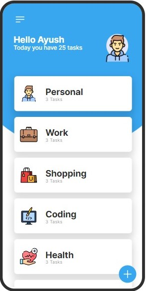

# ToDo-List Application
This To-Do List application, built with HTML, CSS, and JavaScript, provides a simple yet effective solution for managing tasks and improving productivity. Customize and expand the application as needed to suit your workflow and preferences.

## Overview
This TO-DO List application is a simple web-based tool to help you keep track of tasks and manage your day effectively. It allows users to add tasks, mark them as completed, and delete them when they're done.

## Features
- **Add Task**: Easily add new tasks to your list.
- **Mark as Completed**: Check off tasks that you've finished.
- **Delete Task**: Remove tasks from the list once they're completed or no longer needed.
- **Responsive Design**: Works seamlessly across various devices and screen sizes.

## Technologies Used
- HTML: Markup language for structuring the web page.
- CSS: Styling language for designing the appearance of the web page.
- JavaScript: Programming language for adding interactivity and functionality to the web page.

## Usage
1. Clone or download the repository to your local machine.
2. Open the `index.html` file in your web browser.
3. Start adding tasks to your TO-DO list!
   
## Preview

## Contributing
Contributions are welcome! If you'd like to contribute to this project, feel free to fork the repository and submit a pull request with your changes.

## License
This project is licensed under the MIT License. See the [LICENSE](LICENSE) file for details.
